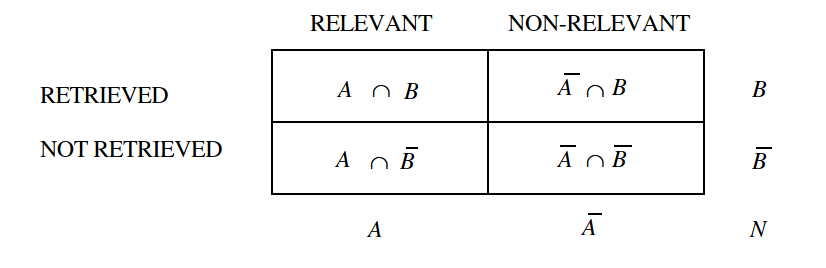

[Source for pytorch script](https://gist.github.com/JohnnyRacer/6f53b814060d14a20c8259b0d9c9894f/revisions)

# Theory

## Evaluation 

[tldr](#precision-and-recall)

## Introduction

### Information storage

- Most commonly used method of evaluation

- survey or more promising attempts

#### Questions

1. Why evaluate?
2. What to evaluate?
3. How to evaluate?

---

1. Why to evaluate?
    - determine the benefits
    - measure the cost
2. What to evaluate?
    - what can be measured to of the system to meet the requirements expected of its output
        a. **Coverage**: what matter does the system cover
        b. **time lag**: how long does it take to fulfill a request
        c. **presentation**: how is the output displayed
        d. **effort**: how much effort does the user require to obtain his answers
        e. **recall** what *relevant* material is retrieved from the search request
        f. **precision**: proportion of relevant retrieved material
    - **(e)-(f)** are what we measure to determine the *effectiveness* of the retrieval system
    - Answer: **precision** and **recall**
        - advantages:
            1. commonly used
            2. well understood
3. How to evaluate?
    - technical
    - ranking is influenced by the retrieval *strategy* and *form* of output
    - underlined by *relevance*

Summary of Relevance in information systems

Relevance
:   Definition
*Subjective* notion defined by users. This can be interpreted as the [*ground truth*](https://www.ibm.com/think/topics/ground-truth) as it real people selective *subjective* features of *real* data. Objective or *logical* relevance is best understood in questions with answer *yes* or *no*.

> A stored sentence is logically relevant to (a representation of) an information need if
and only if it is a member of some minimal premiss set of stored sentences for some
component statement of that need.
*@van1979information, page 114*

---
### Precision and Recall
{width=50%}

#### **Definitions**       
\begin{eqnarray}\text{Precision}=\frac{|A\cap B|}{|B|},\quad
            \text{Recall} = \frac{|A\cap B|}{|A|}\\
            \text{Fallout} = \frac{|\bar{A}\cap B|}{|\bar{A}|} \end{eqnarray}

#### References

